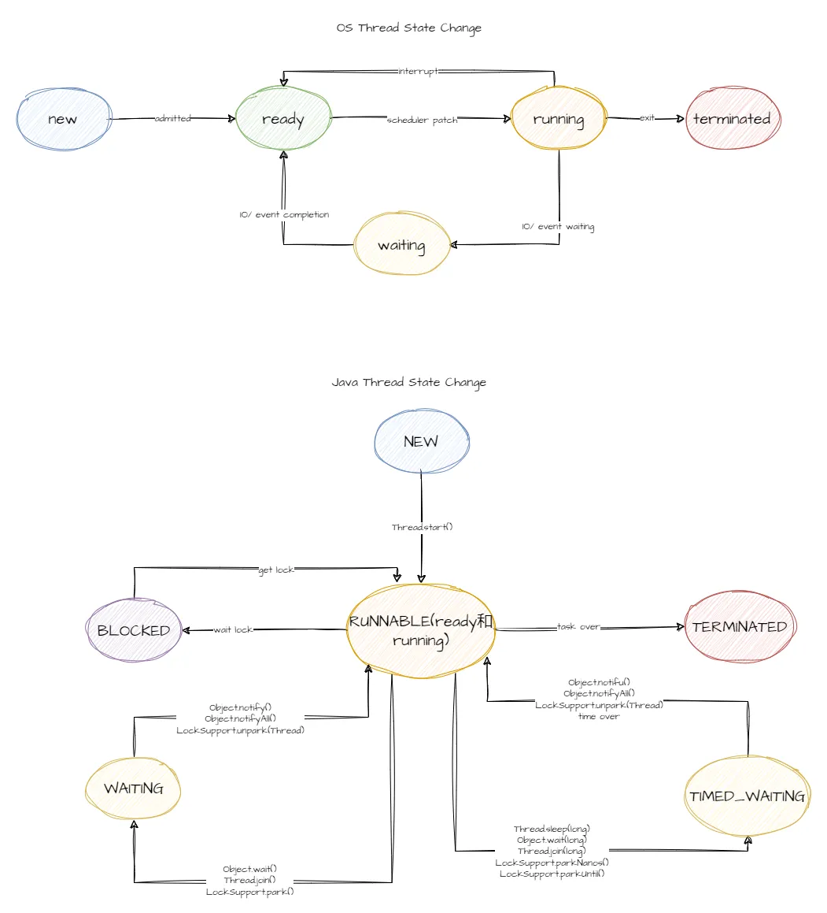
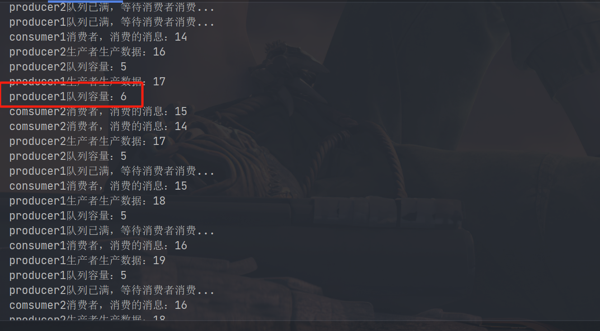
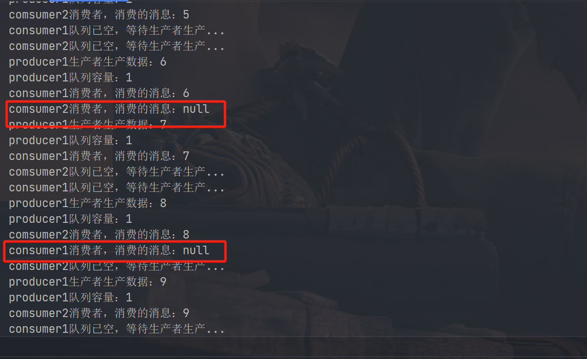

# multi-thread

---
学习多线程的知识

---

## 1.多线程实现方式

> 1. 继承Thread类，重写```run()```方法 
>    see `com.lslt.thread.InheritThread`的实现
>
> 2. 实现`Runnable`接口，并将其实例传递给`Thread`类的构造函数。
>
>    see `com.lslt.thread.MyRunnable`的实现
>
> 3. 使用Executor框架和ThreadPoolExecutor类创建
>
> 4. 实现Callable接口和Future，允许线程返回一个结果或抛出异常
>
>    see com.lslt.thread.MyCallable的实现


## 2.Java线程的状态及转换

> 1. 新建(New)状态:
>
>    ​	线程对象被创建，但是还没有调用start()，此时处于新建状态。
>
> 2. 运行(Runnable)状态：
>
>    ​	调用了start()方法，此时线程可能正在执行或等待CPU的调用(就绪状态)。
>
> 3. 阻塞(Blocked)状态：
>
>    ​	等待IO操作，等待获取锁等。
>
> 4. 等待(Waiting)状态
>
>    ​	线程调用Object.wait()，Thread.join()，LockSupport.park() 等方法。
>
> 5. 超时(Timed Waiting)等待：
>
>    ​	线程调用Object.wait(timeout)，Thread.join(timeout)，Thread.sleep(timeout) 等方法。
>
> 6. 终止(Terminated)状态：
>
>    ​	执行完run()或由于异常提前结束。



## 3.生产-消费者模型

>  **Producer**

```java
public class Producer implements Runnable{
    private final Queue<Integer> queue;
    private final int CAPACITY;

    public Producer(Queue<Integer> queue,int capacity){
        this.queue = queue;
        this.CAPACITY = capacity;
    }

    @Override
    public void run() {
        int value = 0;
        while (true){
            synchronized (queue){
                //生产者等待
                if (queue.size() == CAPACITY){
                    System.out.println(Thread.currentThread().getName()+"队列已满，等待消费者消费...");
                    try {
                        queue.wait();
                    } catch (InterruptedException e) {
                        e.printStackTrace();
                    }
                }
                System.out.println(Thread.currentThread().getName() + "生产者生产数据：" + ++value);
                queue.offer(value);
                //唤醒消费者
                System.out.println(Thread.currentThread().getName()+"队列容量："+queue.size());

                queue.notify();
            }
            try {
                int timeout = new Random().nextInt(1000);
                Thread.sleep(timeout);
            } catch (InterruptedException e) {
                e.printStackTrace();
            }

        }
    }
}
```

> **Consumer**

```java
public class Consumer implements Runnable {

    private final Queue<Integer> queue;

    public Consumer(Queue<Integer> queue) {
        this.queue = queue;
    }


    @Override
    public void run() {
        while (true){
            synchronized (queue){
                //消费者休息
                if (queue.isEmpty()){
                    System.out.println(Thread.currentThread().getName()+"队列已空，等待生产者生产...");
                    try {
                        queue.wait();
                    } catch (InterruptedException e) {
                        e.printStackTrace();
                    }
                }
                Integer value = queue.poll();
                System.out.println(Thread.currentThread().getName() + "消费者，消费的消息："+value);

                queue.notify();
            }
            try {
                int timeout = new Random().nextInt(1000);
                Thread.sleep(timeout);
            } catch (InterruptedException e) {
                e.printStackTrace();
            }

        }
    }
}
```

> **Test**

```java
public class Test {

    public static void main(String[] args) {
        Queue<Integer> queue = new LinkedList<>();
        Producer producer = new Producer(queue, 5);
        Producer producer2 = new Producer(queue, 5);
        Consumer consumer = new Consumer(queue);
        Consumer consumer2 = new Consumer(queue);


        Thread producerThread = new Thread(producer,"producer1");
        Thread producerThread2 = new Thread(producer2,"producer2");
        Thread consumerThread = new Thread(consumer,"consumer1");
        Thread consumerThread2 = new Thread(consumer2,"comsumer2");

        producerThread.start();
        producerThread2.start();
        consumerThread.start();
        consumerThread2.start();

    }
}

```





如果有多个生产者或多个消费者则会出现生产者多生产，消费者多消费的情况。解决这个问题，就是将判断队列是否为空或已满，改成while循环。

详细见：`com.lslt.communication.Consumer`和`com.lslt.communication.Producer`

